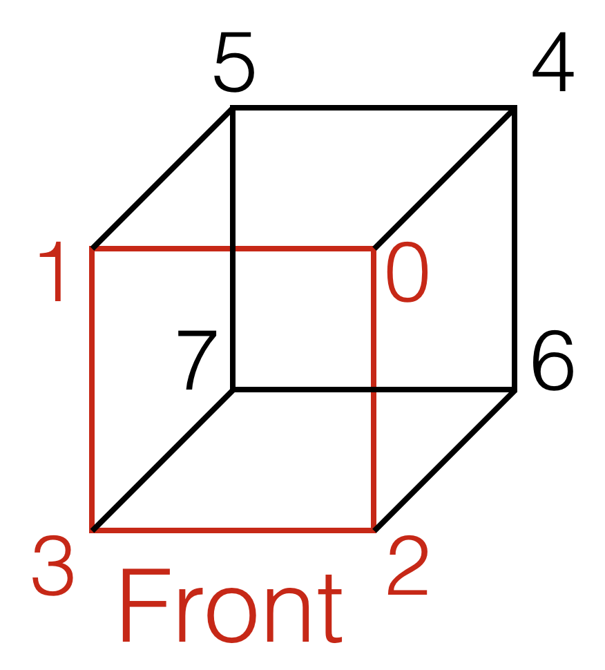

# 3D-Graphics

For this lab, you will be working to draw and rotate a cube.

You may work individually or with a partner of your choosing.
// Back face
0.5f,  0.5f,  -0.5f, 0.0f, 0.0f, 1.0f,// Top right, white
-0.5f,  0.5f,  -0.5f, 1.0f, 1.0f, 0.0f,// Top left, gray
0.5f, -0.5f,  -0.5f, 0.0f, 1.0f, 0.0f,// Bottom right, cyan
-0.5f, -0.5f,  -0.5f, 1.0f, 0.0f, 0.0f,// Bottom left, magenta
## Setup

Use this Guided Project template to create a new repository (see [GitHub-with-CLion](https://github.com/uvmcs2300f2023/GitHub-with-CLion) repo for directions).
**Your repository must be named with the convention: 3D-Graphics-netid**, where netid is your UVM NetID username.
* If you are collaborating, the format is 3D-Graphics-netid1-netid2. Have one partner create the repository and give the other partner access on GitHub: on the repository page, go to the Settings tab, choose Manage Access, and add the person with their GitHub username.

Remember to commit and push frequently.

# Drawing the cube

Below is a labeling of the indices of the cube at its starting position. It will be useful when drawing the faces.



One face of the cube have been drawn for you. It is the face that originally faces forward (with corners colored blue, yellow, green, and red) When you complete the other vertices, color them white, gray, cyan, and magenta.

**Draw the other five faces of the cube.** This should be done in the Cube's ```initVectors``` method. This will require you to complete both the vertices and indices (see TODO comments). The order of the indices matters when drawing, so it's recommended that you draw one face of the cube at a time to ensure correct implementation.

Note that you should not be able to see some faces until you implement rotation by different axes.

# Rotating the cube

Luckily for you, the Cube already has partially functioning x-rotation, which you can see by pressing the up arrow.

**Implement rotation in the other x-direction and both y-directions.** This should be done by completing ```engine.cpp``'s TODOs.

# Moving the camera

The camera position has an effect on how big or small objects appear. The camera for this project is initially at (0, 0, -3), looking at the origin (0, 0, 0).

**Move the camera forward and backward when the g and s keys are pressed, to make the cube appear bigger and smaller.** The TODOs for this are in `engine.cpp::processInput`.

## Grading

If you are collaborating, both partners have to submit the project.

### Grading Rubric
- [ ] (10 pts) Draw other five faces of the cube.
- [ ] (6 pts) Rotate the cube with the other three arrow keys.
- [ ] (4 pts) Move the camera forward and backward with the g and s keys.
